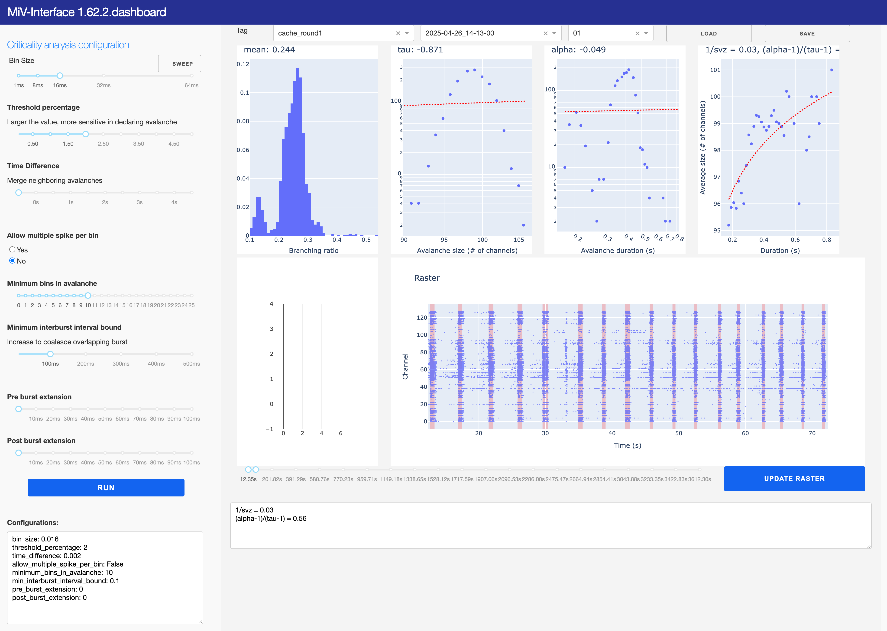

# MiV Criticality Dashboard

A local dashboard for analyzing criticality in neural spike data.

> HPC server usage, please contact [@skim0119](https://github.com/skim0119)



## Installation

We use `uv` to manage python and its dependencies, although you can use `pip`, `poetry`, or `conda` as well.

```bash
curl -LsSf https://astral.sh/uv/install.sh | sh  # install uv
```

Once `uv` is installed, you can install the project dependencies by running:

```bash
git clone https://github.com/skim0119/MiV-Criticality-Dashboard
cd MiV-Criticality-Dashboard
uv sync
source .venv/bin/activate  # activate the virtual environment
```

## Usage

Let's say you have two cache directories, `cache_round1` and `cache_round2`, in the working directory.

```bash
# Directory structure
<dir>
├── cache_round1
│   └── ...
├── cache_round2
│   └── ...
└── MiV-Criticality-Dashboard  <-- repository root
```

Both `cache_round1` and `cache_round2` are produced by `MiV-OS` spike-detection pipeline. (If you did not specify the cache directory, cache files are expected to be in the `result` directory.)

```bash
python run_dashboard.py --port 5050 --workdir ../cache_round1 --workdir ../cache_round2
```

This launches a local server at `http://127.0.0.1:5050`.

## Example processing pipeline from MiV_OS

```py
import pathlib

from miv.io.openephys import DataManager
from miv.signal.filter import ButterBandpass
from miv.signal.spike import ThresholdCutoff
from miv.core.pipeline import Pipeline

folder_path: str | pathlib.Path  # path to the folder containing electrophysiology
result_path: str | pathlib.Path  # path to the result directory
cache_path = "cache_round1"  # path to the cache directory  (Will be used by Dashboard)

data_manager = DataManager(folder_path)
bandpass = ButterBandpass(low=400, high=1500)
spike_detection = ThresholdCutoff()

data_manager[0] >> bandpass >> spike_detection
Pipeline(spike_detection).run(result_path, cache_path, verbose=verbose)
```

For more details, please refer to [MiV-OS](https://github.com/GazzolaLab/MiV-OS) and [MiV project webpage](https://mindinvitro.illinois.edu/).
The project is developed by [GazzolaLab](https://mattia-lab.com/).

## Features

- Interactive visualization of neural spike data
- Criticality analysis with adjustable parameters
- Multiple plot types including:
  - Branching ratio plots
  - Power law plots
  - Raster plots
- Save analysis results to CSV


## Acknowledgments

We would like to acknowledge John Beggs at Indiana University for providing the theoretical framework and guidance on criticality analysis in spiking neural data.

